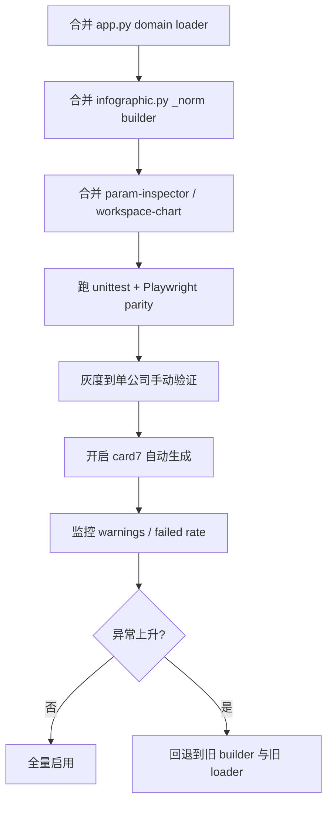

# GZHv2 PRD v2.1 竞争图表修复技术规格说明

## 执行摘要

当前 `chart_competitive` 与 `chart_ecosystem` 的核心缺陷，不只是“样式不好”，而是**数据域、数据语义、预览导出链路**三层同时失真。仓库现状中，后台自动生成与手动生成都复用了 `_load_all_scored_companies`，该函数会直接从 `research` 表取“全库所有 latest standard 公司”，而不是“目标公司 + 它的竞争对手域”，并且只要求 `score_defensibility` 与 `score_value_capture` 非空，却没有对 `score_incumbent_attention`、`funding_stage_score`、`stack_layer` 做图表级必填校验；这会把不属于该目标公司的公司带进图里，也会把关键字段缺失的行带进图里。`get_research` / `get_research_by_key` 已经支持 `company_key` 归一键，但当前图表查询仍按 `company_name` 聚合，存在别名/大小写重复的风险。citeturn17view1turn17view3turn20view0turn20view1turn20view2turn22view0

因此，PRD v2.1 的首要改动必须是新增 **Fix F 数据域隔离**，并把原 Fix A 改成**非破坏式归一化**：保持原始分数字段不变，仅增加 `_norm` 字段供渲染层使用。这样既能解决“右上角挤堆”的视觉问题，又不会污染后续工具链对原始 0–10 分的解释。与此同时，前端工作区当前用 `/chart-data` 拉参数与数据、用 `/preview` 产预览 HTML、用 `/render-html` 导出 PNG；这意味着预览与导出存在分叉代码路径，必须通过“单一构建函数 + PNG 对齐测试”把它们收敛，否则 workspace 看见的和最终 PNG 仍可能不一致。citeturn36view0turn36view1turn36view2turn34view2turn34view3turn40view0

从实现优先级看，建议按 **Fix F → Revised Fix A → 标签与轴配置 → PNG 导出一致性** 的顺序推进。原因很简单：如果域不隔离，归一化就是把“错误集合”重新拉伸；如果归一化是破坏式覆盖，下游 tooltip、审计、回归测试都会失去原始分依据；如果预览与导出仍分叉，任何 workspace 层的修复都无法稳定交付到最终卡片。仓库 README 已明确说明：本项目本地运行，`requirements.txt` 包含 `playwright`，`package.json` 依赖 `echarts@^5.6.0` 与 `puppeteer`，并且 README 写明“图表预览和 Playwright PNG 渲染使用本地 `webapp/static/vendor/echarts.min.js` 副本”，因此在当前主干上实现 ECharts ≥5.3 的 `labelLayout` 方案和 Playwright 导出回归是有环境基础的。citeturn45view0turn46view0turn47view0

## 现状审计与问题边界

`app.py` 中 `_generate_card7_charts` 与 `/api/assets/generate/<company>/<asset_key>` 两条路径，都会在生成 `chart_competitive` / `chart_ecosystem` 时调用同一个 `_load_all_scored_companies(config.DB_PATH_RESEARCH)`，随后分别传入 `render_competitive_landscape` 与 `render_stack_positioning`。这意味着后台自动生成、手动生成、以及图片定稿台如果重用同一后端数据接口时，都会受到同一批脏域数据影响。citeturn17view0turn17view3turn26view0turn26view1turn28view4turn28view5

更关键的是，`_load_all_scored_companies` 当前 SQL 只选取 `company_name, score_defensibility, score_incumbent_attention, score_value_capture, funding_stage_score, stack_layer` 六列，并通过 `MAX(id)` 取每家公司 `version='standard'` 的 latest 行；但筛选条件仅有 `score_defensibility IS NOT NULL AND score_value_capture IS NOT NULL`。这意味着：竞争图会收到 `score_incumbent_attention` 为空的点，生态位图会收到 `funding_stage_score` 或 `stack_layer` 为空的点。也就是说，数据完整性校验和图表使用字段并不一致，这是现有实现里最容易被忽略、但最直接导致“点消失、标签缺失、大小异常”的问题。citeturn17view1turn17view2

另一方面，`research` 表模式本身已经具备足够的信息去做正确的数据域隔离。`init_research_db.sql` 明确包含 `competitors TEXT`，注释说明它是 JSON 数组；同时 schema 中已有 `company_key`、`display_name`、`input_name`、`website_host` 等身份字段扩展，`db.py` 的 `get_research` / `get_research_by_key` 也已经通过 `COALESCE(NULLIF(company_key,''), LOWER(company_name))` 做了主键式回退匹配。换言之，图表层现在的问题不是数据库不支持，而是**图表加载器没有使用现成的身份归一能力和目标公司的竞争对手清单**。citeturn22view0turn20view0turn20view1turn20view2

前端工作区也暴露出一组实现事实：`workspace-chart.js` 在挂载时调用 `StudioAPI.chartData(company, slot.asset_key)` 拉数据，再根据 slot 是否是 `chart_competitive` / `chart_ecosystem` 切换到 ECharts 预览；预览时调用 `/api/image-studio/<company>/<assetKey>/preview`，导出 PNG 时则调用 `/api/image-studio/<company>/<assetKey>/render-html`，并把代码编辑区的 HTML 直接提交。也就是说，当前“预览”和“导出”不是天然同一函数，而是**同一数据模型上的两条路径**。如果不增加显式的一致性测试，修复经常会只在 preview 生效而不在 PNG 生效。citeturn34view0turn34view2turn34view3turn36view0turn36view1turn36view2turn40view0

现有参数面板同样需要同步升级。`param-inspector.js` 目前把 `chart_competitive` 的 `x_split/y_split` 暴露为 `1..9` 的 range，这与 raw 0–10 轴一致，但与 v2.1 想要的 `0..1` 归一化显示相冲突；同时 `show_label` 虽然作为通用 checkbox 已存在，但图表层默认参数 `show_label` 仍为 `False`。如果后端切到 `_norm` 轴而前端仍显示 `1..9` 断点，那么 workspace 会天然误导。citeturn17view1turn26view3turn41view1

下表是本次修复范围内最重要的现状结论。

| 现状位置 | 已观察到的实现 | 直接问题 | v2.1 处置 |
|---|---|---|---|
| `webapp/app.py::_load_all_scored_companies` | 全库 latest standard 扫描，且只校验两列非空 | 竞争域污染、字段缺失混入 | 替换为目标域隔离加载器 |
| `research.competitors` | 已存在 JSON 数组字段 | 但当前图表未使用 | 解析为竞争域白名单 |
| `db.py get_research*` | 已支持 `company_key`/`COALESCE` | 图表查询仍按 `company_name` | 图表查询改用 canonical key |
| `param-inspector.js` | `x_split/y_split` 仍为 `1..9` | 与 0–1 轴不一致 | 改为 `0..1`，默认 `0.5` |
| `workspace-chart.js` + `studio-api.js` | preview 与 render-html 分离 | preview / PNG 可能不一致 | 单一 builder + Playwright 对齐测试 |

以上结论分别来自仓库 `app.py`、`db.py`、`init_research_db.sql`、`workspace-chart.js`、`studio-api.js`、`param-inspector.js` 的公开代码与 README。citeturn17view1turn20view0turn20view1turn22view0turn34view0turn34view2turn34view3turn36view0turn41view1turn45view0

## 目标设计与数据流

### 设计原则

v2.1 应遵守四条硬原则。第一，**域先于图**：竞争图与生态位图首先必须构建“正确公司集合”，再谈坐标映射。第二，**原始分不改写**：任何归一化只产生 `_norm` 字段，原始 raw 分用于 tooltip、调试与审计。第三，**图表参数语义单一化**：workspace、preview、PNG 导出都使用同一组 `params` 与同一 builder。第四，**超限不展示、而不是硬塞**：生产导出最多显示 12 家公司，保证静态 PNG 可读。以上原则分别对应仓库当前 loader、preview/render 分叉、以及 ECharts 标签布局能力边界。ECharts 官方变更记录明确提到 `labelLayout` 用于标签初始定位后的再布局，并可用于避免重叠；FAQ 也明确 `axisLine.lineStyle.color` 可配置轴色；ECharts 文档检索结果与 release note 还给出了 `graphic` 文字元素 `type: 'text'` 的使用方式。citeturn17view1turn34view2turn34view3turn36view0turn52search7turn52search12turn52search2turn52search0turn52search11

### 推荐数据流

```mermaid
flowchart LR
    A[research latest standard rows] --> B[get_research target row]
    B --> C[parse competitors JSON]
    C --> D[_load_chart_company_domain]
    D --> E[chart-specific validation]
    E --> F[max_companies cap]
    F --> G[non-destructive normalization]
    G --> H[build ECharts HTML]
    H --> I[/preview iframe srcdoc]
    H --> J[/render-html -> _html_to_png]
    J --> K[assets_db variant / selected asset]
    K --> L[/api/render-data/<company> -> layout / canvas]
```

该数据流把“域隔离”“字段校验”“归一化”“构建 HTML”“导出 PNG”拆成了可单测的五段。它比“在 builder 里临时 if/else 拼凑数据”更稳定，也更适合定位是 SQL、归一化、还是 ECharts option 造成的问题。当前仓库的 card 产图链路、图片定稿台的 preview/render 分离、以及下游 layout/canvas 读取 render-data 的方式，都支持这种分层重构。citeturn17view0turn17view3turn29view0turn34view2turn34view3turn41view2turn45view0

### Fix F 数据域隔离

建议新增域隔离加载器，签名如下：

```python
def _parse_competitor_names(raw: str | None) -> list[str]: ...
def _canonical_company_key(value: str | None) -> str: ...
def _load_chart_company_domain(
    research_db_path: str,
    target_company: str,
    *,
    version: str = "standard",
    max_companies: int = 12,
) -> list[dict]: ...
```

实现逻辑不是“取全库再过滤”，而是：

1. 用 `database.get_research(...)` 或同等逻辑取目标公司 latest standard 行。  
2. 解析目标行里的 `competitors` JSON，提取 `name` 列表。  
3. 生成 canonical key 集合：`target + competitors`。  
4. 在 `research` 表中按 canonical key + `MAX(id)` 取 latest rows。  
5. 仅保留图表所需基础列：`company_name / display_name / company_key / competitors / score_* / funding_stage_score / stack_layer`。  
6. 按 competitor 原始顺序截断到 `max_companies=12`。  
7. 如果目标公司不在结果中，直接失败；如果竞争对手有效数量为 0，则返回 warning 并阻断“竞争图自动生成”。  

现有 schema 已表明 `competitors` 为 JSON 数组，且 `company_key` 体系已具备，所以这是**应用层正确使用现有 schema**，而不是一次高风险 schema 迁移。citeturn22view0turn20view0turn20view1

推荐 SQL 示例为：

```sql
SELECT
  company_name,
  display_name,
  COALESCE(NULLIF(company_key, ''), LOWER(company_name)) AS company_key,
  competitors,
  score_defensibility,
  score_incumbent_attention,
  score_value_capture,
  funding_stage_score,
  stack_layer
FROM research
WHERE version = :version
  AND id IN (
    SELECT MAX(id)
    FROM research
    WHERE version = :version
      AND COALESCE(NULLIF(company_key, ''), LOWER(company_name)) IN (:k1, :k2, :k3, ...)
    GROUP BY COALESCE(NULLIF(company_key, ''), LOWER(company_name))
  );
```

这里继续沿用当前仓库已经采用的 `MAX(id)` 取 latest 的方式，而不是贸然切到窗口函数。这样做对现有 SQLite 兼容性最稳。当前 `_load_all_scored_companies` 也正是用 `MAX(id)` 分组 latest，只是分组维度错用了 `company_name`，并且没有目标域约束。citeturn17view1turn17view2turn20view0turn20view1

### Revised Fix A 非破坏式归一化

建议在 `webapp/infographic.py` 新增：

```python
def normalize_group_scores(
    companies: list[dict],
    raw_keys: list[str],
    *,
    suffix: str = "_norm",
    neutral: float = 0.5,
) -> tuple[list[dict], dict[str, dict[str, float | None]]]:
    ...
```

设计规则如下。

对每个 raw key，提取当前域内所有非空值。若该 key 全空，则 `_norm` 保持 `None`。若 `max == min`，则所有非空点统一给 `neutral=0.5`，并把该 key 记入 `meta["all_equal_keys"]`。否则按 `0..1` min-max 归一化写入新字段，例如：

- `score_defensibility_norm`
- `score_incumbent_attention_norm`
- `score_value_capture_norm`

原始字段绝不覆盖。这样做的收益是明确的：当前仓库默认参数和工作区仍把图表理解为“一个带标题、subtitle、note、show_label、point_size 的可编辑对象”，如果直接覆盖原始字段，会让 tooltip、日志、手动调参全部失去语义一致性；非破坏式方案则不会。citeturn26view3turn41view1turn34view0

### 竞争图与生态位图的图表语义

竞争图应将 X/Y 轴全部切换到 `0..1`，分割线固定在 `0.5`。坐标副标题固定说明“组内相对排名，Tooltip 保留原始 0–10 分”。tooltip 同时显示 normalized 与 raw，例如：

```text
公司：Anthropic
护城河（相对）：0.82
护城河（原始）：7.8 / 10
巨头竞争压力（相对）：0.64
巨头竞争压力（原始）：6.2 / 10
```

生态位图也应把 `score_value_capture_norm` 作为 X 轴主坐标，X 轴显示范围固定 `0..1`，并通过 `markLine` 在 `0.33 / 0.66` 处分段；同时用 `graphic` 在轴下方绘制“低捕获 / 中等 / 高捕获”文字说明。`graphic` 使用 `type: 'text'` 是 ECharts 官方能力；`labelLayout` 也是 ECharts 用于减少标签碰撞的官方能力；`axisLine.lineStyle.color` 则是官方 FAQ 明示的轴颜色配置入口。citeturn52search0turn52search11turn52search7turn52search12turn52search2turn52search9

### 标签策略与数量上限

生产导出建议**最多展示 12 家公司**。这是静态 PNG 的硬约束，不应该用“看情况挪一挪”替代。推荐规则：

- `visible_points <= 12`：全部公司显示 label。  
- `visible_points > 12`：  
  - 导出路径：直接截断为 `1 个 target + 最多 11 个 competitors`。  
  - workspace 诊断路径：允许保留更多点，但只显示 target + 前 11 个高优先级 label，其余点只保留 tooltip。  

优先级以“目标公司始终第一，竞争对手按 `competitors` JSON 原始顺序排列”为准，而不是按数值大小排序。原因是这张图的阅读目标是“目标公司相对其声明竞争对手的关系”，不是“从数据库全局筛一个最漂亮的 12 个点”。现有 `competitors` 字段正是为了表达这个域。citeturn22view0

### 方案对比

| 方案 | 做法 | 优点 | 缺点 | 结论 |
|---|---|---|---|---|
| 渲染层非破坏式归一化 | raw 保留，新增 `_norm` 字段，仅图表使用 | 风险小；不改 DB；tooltip 可同时显示 raw/norm；回滚容易 | 需要前后端参数同步 | 推荐 |
| 渲染层破坏式覆盖 | 直接把 raw 改写为 `0..1` | 实现最短 | raw 分语义丢失；tooltip/审计失真；测试难定位 | 不采用 |
| DB 落盘归一化 | 写回研究库或新增列持久化 | 可复用 | 归一化依赖“当前域”，不适合全局持久化；历史回放困难 | 不采用 |

当前仓库图表加载是按运行时生成、并且针对某一公司产图，因此“域依赖的相对分数”天然属于渲染层语义，而不是 research 数据库事实。citeturn17view1turn17view3

## 实施方案与补丁设计

### 补丁文件清单

| 文件 | 变更类型 | 摘要 |
|---|---|---|
| `webapp/app.py` | 替换与扩展 | 废弃 `_load_all_scored_companies` 主调用；新增 `target-domain` loader；修正自动生成与手动生成入口 |
| `webapp/infographic.py` | 主要逻辑 | 新增 `_norm` 归一化、tooltip raw/norm 双显示、0–1 轴、标签策略、截断与 warning |
| `image-studio/js/param-inspector.js` | 参数面板 | `x_split/y_split` 改为 `0..1`；新增 `max_companies`、`label_max_chars`、`show_all_labels_threshold`、`raw_score_max` |
| `image-studio/js/workspace-chart.js` | 工作区行为 | 保证 preview/export 使用同一 HTML 源；显示 truncation/warning；确认状态提示更明确 |
| `tests/test_app.py` 或 `tests/test_chart_domain_loader.py` | 单元测试 | 数据域隔离、company_key 回退、缺失 competitor、最大公司数 |
| `tests/test_infographic_chart_v21.py` | 单元测试 | 归一化、all-equal、tooltip 文案、label 分支 |
| `tests/test_chart_export_parity_playwright.py` | 集成测试 | preview iframe 与导出 PNG 一致性 |

该文件清单是基于仓库主干目录和现有测试目录推导出的最小稳定改动集；`tests/` 目录已存在 `test_app.py`、`test_competitive_*`、`test_screenshot_client.py` 等文件，可无缝接入。citeturn45view0turn53view0

### Python 补丁

下面的 `app.py` 补丁应直接替换 `_load_all_scored_companies` 的使用方式，并新增域隔离函数。这里保留现有“latest 用 `MAX(id)`”风格，以减少行为漂移。

```diff
*** webapp/app.py
@@
-def _load_all_scored_companies(research_db_path: str) -> list[dict]:
-    """加载所有有评分的公司数据（用于散点图）"""
-    import sqlite3
-    conn = sqlite3.connect(research_db_path)
-    conn.row_factory = sqlite3.Row
-    rows = conn.execute(
-        "SELECT company_name, score_defensibility, score_incumbent_attention, "
-        "score_value_capture, funding_stage_score, stack_layer "
-        "FROM research "
-        "WHERE version='standard' "
-        "AND score_defensibility IS NOT NULL AND score_value_capture IS NOT NULL "
-        "AND id IN ("
-        "  SELECT MAX(id) FROM research "
-        "  WHERE version='standard' GROUP BY company_name"
-        ")"
-    ).fetchall()
-    conn.close()
-    return [dict(r) for r in rows]
+def _canonical_company_key(value: str | None) -> str:
+    return (value or "").strip().lower()
+
+def _parse_competitor_names(raw: str | None) -> list[str]:
+    if not raw:
+        return []
+    try:
+        data = json.loads(raw)
+    except Exception:
+        return []
+    out: list[str] = []
+    if isinstance(data, list):
+        for item in data:
+            if isinstance(item, dict):
+                name = (item.get("name") or "").strip()
+            else:
+                name = str(item).strip()
+            if name:
+                out.append(name)
+    # 去重但保留顺序
+    seen = set()
+    uniq = []
+    for name in out:
+        k = _canonical_company_key(name)
+        if k and k not in seen:
+            seen.add(k)
+            uniq.append(name)
+    return uniq
+
+def _load_chart_company_domain(
+    research_db_path: str,
+    target_company: str,
+    *,
+    version: str = "standard",
+    max_companies: int = 12,
+) -> list[dict]:
+    """
+    仅加载目标公司及其 competitors JSON 声明的竞争域。
+    返回 latest standard rows，且保留 raw score 字段。
+    """
+    import sqlite3
+
+    target_row = database.get_research(research_db_path, target_company, version)
+    if not target_row:
+        return []
+
+    target_key = _canonical_company_key(
+        target_row.get("company_key") or target_row.get("company_name") or target_company
+    )
+    competitor_names = _parse_competitor_names(target_row.get("competitors"))
+
+    ordered_keys: list[str] = [target_key]
+    seen = {target_key}
+    for name in competitor_names:
+        k = _canonical_company_key(name)
+        if k and k not in seen:
+            ordered_keys.append(k)
+            seen.add(k)
+
+    if len(ordered_keys) > max_companies:
+        ordered_keys = ordered_keys[:max_companies]
+
+    conn = sqlite3.connect(research_db_path)
+    conn.row_factory = sqlite3.Row
+    placeholders = ",".join("?" for _ in ordered_keys)
+    rows = conn.execute(
+        f"""
+        SELECT
+          company_name,
+          display_name,
+          COALESCE(NULLIF(company_key, ''), LOWER(company_name)) AS company_key,
+          competitors,
+          score_defensibility,
+          score_incumbent_attention,
+          score_value_capture,
+          funding_stage_score,
+          stack_layer
+        FROM research
+        WHERE version = ?
+          AND id IN (
+            SELECT MAX(id)
+            FROM research
+            WHERE version = ?
+              AND COALESCE(NULLIF(company_key, ''), LOWER(company_name)) IN ({placeholders})
+            GROUP BY COALESCE(NULLIF(company_key, ''), LOWER(company_name))
+          )
+        """,
+        [version, version, *ordered_keys],
+    ).fetchall()
+    conn.close()
+
+    items = [dict(r) for r in rows]
+    rank = {k: i for i, k in enumerate(ordered_keys)}
+    items.sort(key=lambda r: rank.get(_canonical_company_key(r.get("company_key")), 10**6))
+    return items
@@
-    companies = _load_all_scored_companies(config.DB_PATH_RESEARCH)
+    companies = _load_chart_company_domain(
+        config.DB_PATH_RESEARCH,
+        company_name,
+        max_companies=12,
+    )
@@
-        companies = _load_all_scored_companies(config.DB_PATH_RESEARCH)
+        companies = _load_chart_company_domain(
+            config.DB_PATH_RESEARCH,
+            company,
+            max_companies=12,
+        )
```

这里最重要的不是“写对 SQL”，而是**把语义从全局扫描改成目标域扫描**。当前 `get_research` 已有 company_key 回退逻辑，因此上面的 canonical key 设计与现有仓库是一致方向。citeturn20view0turn20view1turn17view1turn17view3

`webapp/infographic.py` 的核心补丁建议如下。为降低风险，保留现有 `build_competitive_landscape_svg` / `build_stack_positioning_svg` / `render_*` 函数名，只替换其数据准备与 option 生成逻辑。

```diff
*** webapp/infographic.py
@@
+def normalize_group_scores(
+    companies: list[dict],
+    raw_keys: list[str],
+    *,
+    suffix: str = "_norm",
+    neutral: float = 0.5,
+) -> tuple[list[dict], dict]:
+    meta = {"ranges": {}, "all_equal_keys": []}
+    out = [dict(c) for c in companies]
+    for key in raw_keys:
+        vals = [float(c[key]) for c in out if c.get(key) is not None]
+        if not vals:
+            meta["ranges"][key] = {"min": None, "max": None}
+            for c in out:
+                c[f"{key}{suffix}"] = None
+            continue
+        lo, hi = min(vals), max(vals)
+        meta["ranges"][key] = {"min": lo, "max": hi}
+        if hi == lo:
+            meta["all_equal_keys"].append(key)
+            for c in out:
+                c[f"{key}{suffix}"] = neutral if c.get(key) is not None else None
+            continue
+        for c in out:
+            raw = c.get(key)
+            c[f"{key}{suffix}"] = round((float(raw) - lo) / (hi - lo), 3) if raw is not None else None
+    return out, meta
+
+def _truncate_label(name: str, max_chars: int = 6) -> str:
+    name = (name or "").strip()
+    return name if len(name) <= max_chars else f"{name[:max_chars]}…"
+
+def _point_priority(points: list[dict], target_company: str, max_companies: int) -> list[dict]:
+    # points 已按 domain loader 排好序：target first, competitors ordered
+    if len(points) <= max_companies:
+        return points
+    target_key = (target_company or "").strip().lower()
+    keep = []
+    for p in points:
+        if (p.get("company_name") or "").strip().lower() == target_key:
+            keep.append(p)
+            break
+    for p in points:
+        if p not in keep:
+            keep.append(p)
+        if len(keep) >= max_companies:
+            break
+    return keep
@@
 def build_competitive_landscape_svg(companies: list[dict], target_company: str, params: dict | None = None) -> str:
-    # 旧逻辑：直接使用 raw 0-10 score
+    params = {**{
+        "title": "竞争格局定位图",
+        "subtitle": "坐标为组内相对排名，Tooltip 保留原始 0–10 分",
+        "note": "",
+        "width": 900,
+        "height": 600,
+        "point_size": 12,
+        "x_split": 0.5,
+        "y_split": 0.5,
+        "show_label": True,
+        "max_companies": 12,
+        "label_max_chars": 6,
+        "show_all_labels_threshold": 12,
+        "raw_score_max": 10,
+    }, **(params or {})}
+
+    domain = [
+        c for c in companies
+        if c.get("score_defensibility") is not None
+        and c.get("score_incumbent_attention") is not None
+    ]
+    domain = _point_priority(domain, target_company, int(params["max_companies"]))
+    normed, norm_meta = normalize_group_scores(
+        domain,
+        ["score_defensibility", "score_incumbent_attention"],
+    )
+
+    points = []
+    for c in normed:
+        name = c.get("display_name") or c.get("company_name") or ""
+        is_target = (c.get("company_name") or "").strip().lower() == target_company.strip().lower()
+        points.append({
+            "name": name,
+            "company_name": c.get("company_name") or name,
+            "x_norm": c.get("score_incumbent_attention_norm"),
+            "y_norm": c.get("score_defensibility_norm"),
+            "x_raw": c.get("score_incumbent_attention"),
+            "y_raw": c.get("score_defensibility"),
+            "is_target": is_target,
+            "symbolSize": int(params["point_size"]) + (6 if is_target else 0),
+        })
+
+    visible_count = len(points)
+    show_all = visible_count <= int(params["show_all_labels_threshold"])
@@
-    option = {...}
+    option = {
+        "animation": False,
+        "grid": {"left": 80, "right": 40, "top": 80, "bottom": 90},
+        "title": {
+            "text": params["title"],
+            "subtext": params["subtitle"],
+            "left": "center",
+        },
+        "tooltip": {
+            "trigger": "item",
+            "formatter": """
+            function (p) {
+              const d = p.data || {};
+              const rawMax = 10;
+              return [
+                '<b>' + (d.name || '') + '</b>',
+                '护城河（相对）：' + (d.y_norm ?? '-'),
+                '护城河（原始）：' + ((d.y_raw ?? '-') + ' / ' + rawMax),
+                '巨头竞争压力（相对）：' + (d.x_norm ?? '-'),
+                '巨头竞争压力（原始）：' + ((d.x_raw ?? '-') + ' / ' + rawMax)
+              ].join('<br/>');
+            }
+            """,
+        },
+        "xAxis": {
+            "type": "value",
+            "min": 0, "max": 1,
+            "name": "巨头竞争压力 →",
+            "nameTextStyle": {"color": "#1B2A4A", "fontSize": 13, "fontWeight": "bold"},
+            "axisLine": {"lineStyle": {"color": "#1B2A4A", "width": 1.5}},
+            "axisLabel": {"color": "#1B2A4A", "fontSize": 11},
+            "splitLine": {"lineStyle": {"color": "#E0E6EF", "type": "dashed"}},
+        },
+        "yAxis": {
+            "type": "value",
+            "min": 0, "max": 1,
+            "name": "护城河强度 ↑",
+            "nameTextStyle": {"color": "#1B2A4A", "fontSize": 13, "fontWeight": "bold"},
+            "axisLine": {"lineStyle": {"color": "#1B2A4A", "width": 1.5}},
+            "axisLabel": {"color": "#1B2A4A", "fontSize": 11},
+            "splitLine": {"lineStyle": {"color": "#E0E6EF", "type": "dashed"}},
+        },
+        "series": [{
+            "type": "scatter",
+            "data": points,
+            "encode": {"x": "x_norm", "y": "y_norm"},
+            "symbolSize": "function(d){ return d.symbolSize || 12; }",
+            "label": {
+                "show": True,
+                "position": "right",
+                "distance": 6,
+                "fontSize": 10,
+                "color": "#1B2A4A",
+                "backgroundColor": "rgba(255,255,255,0.75)",
+                "borderRadius": 2,
+                "padding": [2, 4],
+                "formatter": f"function(p) {{ return {str(show_all).lower()} || p.data.is_target ? '{''}' : ''; }}",
+            },
+            "labelLayout": {"hideOverlap": False, "moveOverlap": "shiftY"},
+            "markLine": {
+                "silent": True,
+                "lineStyle": {"color": "#BBCFDF", "type": "dashed", "width": 1},
+                "data": [{"xAxis": float(params["x_split"])}, {"yAxis": float(params["y_split"])}]
+            }
+        }],
+        "graphic": [{
+            "type": "text",
+            "left": 20,
+            "bottom": 16,
+            "style": {
+                "text": params["note"] or ("组内归一化：" + ", ".join(norm_meta["all_equal_keys"]) + " 全相等时取 0.5" if norm_meta["all_equal_keys"] else ""),
+                "fontSize": 10,
+                "fill": "#8A9BB0",
+            }
+        }]
+    }
```

生态位图的改法与此相同，但要把 X 轴换成 `score_value_capture_norm`，tooltip 显示 `score_value_capture_raw/norm`，并在 `graphic` 中加三段说明，在 `markLine` 中加 `0.33/0.66` 两条竖线。出于代码复用，建议再抽一个 `_build_scatter_option(chart_kind, points, params, meta)`，让 competitive 与 ecosystem 共用 tooltip/label/markLine/graphic 的基础结构。ECharts 预览与渲染依赖本地 `echarts.min.js`，这一点仓库 README 已写明，因此无需再引入新的 CDN 路径。citeturn45view0turn52search13

### 前端 JS 补丁

`param-inspector.js` 必须把 raw 0–10 语义改成 normalized 0–1 语义，否则工作区调参会误导用户。

```diff
*** image-studio/js/param-inspector.js
@@
       chart_competitive: [
-        { group: 'chart', key: 'x_split', label: '象限分割点', type: 'range', min: 1, max: 9, step: 0.5 },
-        { group: 'chart', key: 'y_split', label: '象限分割点', type: 'range', min: 1, max: 9, step: 0.5 },
+        { group: 'chart', key: 'x_split', label: '象限分割点', type: 'range', min: 0, max: 1, step: 0.01 },
+        { group: 'chart', key: 'y_split', label: '象限分割点', type: 'range', min: 0, max: 1, step: 0.01 },
         { group: 'chart', key: 'point_size', label: '基础气泡', type: 'range', min: 4, max: 28, step: 1 },
+        { group: 'chart', key: 'max_companies', label: '最多显示公司数', type: 'range', min: 4, max: 12, step: 1 },
+        { group: 'chart', key: 'label_max_chars', label: '标签截断字符数', type: 'range', min: 4, max: 12, step: 1 },
+        { group: 'chart', key: 'show_all_labels_threshold', label: '全量标签阈值', type: 'range', min: 4, max: 12, step: 1 },
+        { group: 'chart', key: 'raw_score_max', label: '原始分上限', type: 'range', min: 10, max: 10, step: 1 },
       ],
       chart_ecosystem: [
         { group: 'chart', key: 'point_size', label: '基础气泡', type: 'range', min: 4, max: 28, step: 1 },
+        { group: 'chart', key: 'max_companies', label: '最多显示公司数', type: 'range', min: 4, max: 12, step: 1 },
+        { group: 'chart', key: 'label_max_chars', label: '标签截断字符数', type: 'range', min: 4, max: 12, step: 1 },
+        { group: 'chart', key: 'show_all_labels_threshold', label: '全量标签阈值', type: 'range', min: 4, max: 12, step: 1 },
+        { group: 'chart', key: 'raw_score_max', label: '原始分上限', type: 'range', min: 10, max: 10, step: 1 },
       ],
```

当前 schema 确实把 `x_split/y_split` 定义为 `1..9`，并且 `show_label` 是通用项；这正是本次需要调整的地方。citeturn41view1

`workspace-chart.js` 的最小改动，是在 render 时优先提交 `this._latestPreviewHtml`，而不是完全依赖编辑器 textarea 的瞬时状态；同时把后端返回的 warning/truncated 信息回显到状态区。这样可以减少 preview/export 分叉。

```diff
*** image-studio/js/workspace-chart.js
@@
-      if (this._isEchartsSlot() && codeEditor) {
-        result = await StudioAPI.renderChartHtml(this._company, this._slot.asset_key, codeEditor.value, this._params);
+      if (this._isEchartsSlot()) {
+        const stableHtml = this._latestPreviewHtml || codeEditor?.value || '';
+        result = await StudioAPI.renderChartHtml(
+          this._company,
+          this._slot.asset_key,
+          stableHtml,
+          this._params
+        );
       } else {
         result = await StudioAPI.renderChart(this._company, this._slot.asset_key, templateId, this._params);
       }
```

之所以只建议做这个最小改动，而不是再引入一层复杂 diff 编辑器，是因为当前工作区已经用 `iframe.srcdoc` 直接回放 preview HTML，并且 `_syncCodeEditor()` 会把 preview HTML 同步回 textarea；提交 `_latestPreviewHtml` 能最大限度保证 PNG 与 iframe 预览一致。citeturn34view2turn34view3turn40view0

## 测试、导出一致性与上线策略

### 单元与集成测试计划

现有仓库已具备完整 `tests/` 目录，并包含 `test_app.py`、`test_competitive_batch.py`、`test_competitive_scoring.py`、`test_screenshot_client.py` 等文件，因此 v2.1 不应另起一套测试框架，而应在原目录下注入以下测试。citeturn53view0

建议的 Python 单测清单如下。

```python
# tests/test_chart_domain_loader.py

def test_load_chart_company_domain_only_target_and_competitors(): ...
def test_load_chart_company_domain_prefers_company_key_over_company_name(): ...
def test_load_chart_company_domain_keeps_target_first_and_competitor_order(): ...
def test_load_chart_company_domain_caps_to_twelve(): ...
def test_load_chart_company_domain_no_competitors_returns_target_only_warning(): ...

# tests/test_infographic_chart_v21.py

def test_normalize_group_scores_non_destructive(): ...
def test_normalize_group_scores_all_equal_to_half(): ...
def test_competitive_chart_drops_null_incumbent_attention(): ...
def test_ecosystem_chart_drops_null_stack_layer_or_uses_warning(): ...
def test_tooltip_contains_raw_and_norm_scores(): ...
def test_competitive_chart_uses_zero_to_one_axes(): ...
def test_ecosystem_chart_has_low_mid_high_reference_labels(): ...
```

其中最关键的断言不是“HTML 长什么样”，而是：

- raw 字段仍存在且值不变；  
- `_norm` 字段存在且范围在 `0..1`；  
- all-equal -> 0.5；  
- `chart_competitive` 不接收 `score_incumbent_attention is None` 的点；  
- `chart_ecosystem` 不接收 `stack_layer is None` 的点；  
- 结果点数不超过 12。  

这些断言直接对应现有 loader 只校验两列的缺陷。citeturn17view1turn17view2

### Playwright PNG 导出一致性测试

仓库 README 已明确提到 Playwright PNG 渲染与本地 ECharts vendor 路径，`requirements.txt` 也包含 `playwright`；Playwright 官方文档说明 `page.screenshot()` 用于截图，`page.wait_for_function()` 可等待任意 JS 条件为真，而 `networkidle` 不建议作为测试就绪条件，应更依赖显式断言。这正适合做“preview iframe 与最终 PNG 一致性”的回归。citeturn45view0turn47view0turn48search1turn51search0turn48search3

推荐新增 `tests/test_chart_export_parity_playwright.py`：

```python
from pathlib import Path
from playwright.sync_api import sync_playwright
import hashlib
import requests

BASE = "http://127.0.0.1:5050"

def sha256_bytes(data: bytes) -> str:
    return hashlib.sha256(data).hexdigest()

def test_chart_competitive_preview_export_parity(tmp_path: Path):
    company = "Anthropic"
    asset_key = "chart_competitive"

    chart_data = requests.post(f"{BASE}/api/image-studio/{company}/{asset_key}/chart-data", json={}).json()
    preview_html = requests.post(
        f"{BASE}/api/image-studio/{company}/{asset_key}/preview",
        json={"params": chart_data["params"], "data": chart_data["data"]},
    ).text

    with sync_playwright() as p:
        browser = p.chromium.launch()
        page = browser.new_page(viewport={"width": 900, "height": 600})
        page.set_content(preview_html, wait_until="load")
        page.wait_for_function("() => !!window.echarts")
        page.wait_for_function("() => document.querySelector('#chart, canvas, svg')")
        preview_png = tmp_path / "preview.png"
        page.screenshot(path=str(preview_png))
        browser.close()

    render_result = requests.post(
        f"{BASE}/api/image-studio/{company}/{asset_key}/render-html",
        json={"html": preview_html, "params": chart_data["params"]},
    ).json()

    exported_path = Path("webapp") / render_result["local_path"].lstrip("/")
    assert exported_path.exists()

    # 基础一致性：文件非空、尺寸一致、hash 可记录
    assert preview_png.stat().st_size > 0
    assert exported_path.stat().st_size > 0

    # 更严格可加入图像 diff；先做像素尺寸 + perceptual diff 阈值
```

如果团队允许更严格检查，建议再加 `Pillow` perceptual diff，阈值控制在 `< 1.5%` 的像素差异。这样既利用了 Playwright 的页面级截图能力，也避免把测试建立在 `networkidle` 这种官方不推荐的就绪信号上。citeturn48search1turn51search0turn48search3

### 风险分析

| 风险 | 触发条件 | 影响 | 缓解 |
|---|---|---|---|
| 竞争对手 JSON 缺失或脏数据 | `competitors` 为空、非 JSON、无 `name` | 竞争图域为空或只剩 target | 返回 warning；自动生成标记 `needs_review/failed`，不再回落到“全库扫描” |
| 所有分数相等 | 某字段域内值完全相同 | 归一化分母为 0 | `_norm = 0.5`；note 增加 all-equal 提示 |
| 别名/大小写重复 | `company_name` 存在大小写或别名变体 | 同一公司重复出点 | 一律按 `company_key` canonical key 聚合 |
| 超过 12 家公司 | competitor 列表过长 | label 过密，PNG 不可读 | 生产导出硬截断，workspace 显示 truncation/warning |
| preview / export 漂移 | preview 用 builder，export 用旧 HTML | 预览正确但导出错误 | render 直接使用 `_latestPreviewHtml`；加 Playwright parity test |
| 轴参数旧语义残留 | 前端仍显示 `1..9` split | 用户调参错误 | `param-inspector.js` 全面切换到 `0..1` |

### 上线与回滚

建议采用一次小范围、可逆的应用层发布，而不是同时动 DB schema。部署顺序如下。



回滚策略必须简单：  
如果上线后图表失败率上升，只回退 `app.py` loader 调用与 `infographic.py` builder 层，不回滚 research schema，因为本次方案本身**不改 DB**。这也是渲染层 `_norm` 方案比 DB 落盘方案更适合 P0 修复的原因。citeturn17view1turn20view2

### 预估工时

| 任务 | 开发工时 | 测试工时 | 备注 |
|---|---:|---:|---|
| `app.py` 域隔离 loader 与调用替换 | 4h | 2h | 包含 SQL、warning 与截断 |
| `infographic.py` 归一化与 ECharts option 重构 | 6h | 3h | 两张图共用 builder 最值得投入 |
| `param-inspector.js` / `workspace-chart.js` 调整 | 3h | 1.5h | 主要是参数语义与导出一致性 |
| 单元测试补充 | 3h | 1h | 可与上面并行 |
| Playwright parity 测试 | 3h | 2h | 首次调通成本略高 |
| 手动验收与灰度发布 | 1.5h | 1h | 手机宽度截图、PNG 比对 |
| 合计 | 20.5h | 10.5h | 约 3.5 个工程日 |

这是高置信度的工程估算，不依赖外部文档；如果本地开发环境已有 Playwright 浏览器缓存，可再缩短约 1–2 小时。

## 更新后的验收标准与检查清单

### 更新后的验收标准

| 验收项 | 标准 |
|---|---|
| 数据域隔离 | `chart_competitive` / `chart_ecosystem` 只包含目标公司与其 `competitors` JSON 解析出的公司，不允许再使用全库公司池 |
| 身份去重 | 同一公司只允许出现一次；大小写/别名统一按 `company_key` 或 canonical key 聚合 |
| 非破坏式归一化 | raw 分保留；渲染层新增 `_norm` 字段；tooltip 同时显示 raw 与 norm |
| 竞争图坐标 | X/Y 轴均为 `0..1`；中线固定 `0.5`；副标题说明“组内相对排名” |
| 生态位图参照 | X 轴为 `0..1`；`0.33/0.66` 分段与“低/中/高捕获”说明完整显示 |
| 标签可读性 | `<=12` 点全部显示 label；`>12` 时生产 PNG 不超过 12 家公司；target 始终高亮 |
| 缺失值处理 | 缺失必需字段的公司不渲染到对应图；系统产出 warning，而不是静默画错 |
| all-equal 处理 | 任一维度全相等时，点置于 `0.5`，并在 note/warning 中说明 |
| 工作区一致性 | workspace iframe 与 `render-html` 导出的 PNG 在人工比对与 Playwright 回归中一致 |
| 手机可读性 | 375px 宽截图下，轴标题、刻度、标签肉眼可辨 |
| 自动生成稳定性 | `_generate_card7_charts` 和 `/api/assets/generate/...` 结果一致 |

### 发布前检查清单

| 检查项 | 完成条件 |
|---|---|
| `_load_all_scored_companies` 不再作为竞争图主入口使用 | 已完成 |
| `target + competitors` 域隔离函数接入自动生成与手动生成 | 已完成 |
| `company_key`/canonical key 聚合已启用 | 已完成 |
| `_norm` 字段替代 raw 覆盖 | 已完成 |
| tooltip 显示 raw + norm | 已完成 |
| `param-inspector.js` 的 split 控件改为 `0..1` | 已完成 |
| `max_companies=12` 默认值生效 | 已完成 |
| 缺失 competitor 的 warning 可见 | 已完成 |
| Playwright parity 测试通过 | 已完成 |
| 手机宽度人工截图验收通过 | 已完成 |
| 回滚开关或旧函数保留一版 | 已完成 |

## 开放问题与限制

本规格已经足够支撑 PRD v2.1 直接开发，但仍有两点应明示。其一，我已确认图片定稿台前端确实调用 `/chart-data`、`/preview`、`/render-html`，但没有逐行审到这几个 image-studio 后端路由在 `app.py` 中的完整实现，因此上面的后端返回结构部分是**基于前端调用契约做的高置信度设计约束**，不是逐行摘录。其二，我已确认 README 记录了 `canvas/screenshot.js`、本地 ECharts vendor 与 Playwright/Puppeteer 依赖，但没有逐行审到 `canvas/screenshot.js` 的实际脚本细节，因此本文中的 PNG parity 测试方案以 image-studio ECharts 导出链路为主，而不是去改写 canvas 批量导出脚本本身。citeturn36view0turn36view1turn36view2turn45view0turn46view0turn47view0

如果只做一件事，必须先做 **Fix F 数据域隔离**。因为当前最大的逻辑错误不是“分数分布不好看”，而是**图本身可能不是该公司的竞争图**。在这个前提没修正前，任何 label、颜色、markLine、subtitle 都只是把错误结果画得更精致。citeturn17view1turn22view0turn20view0